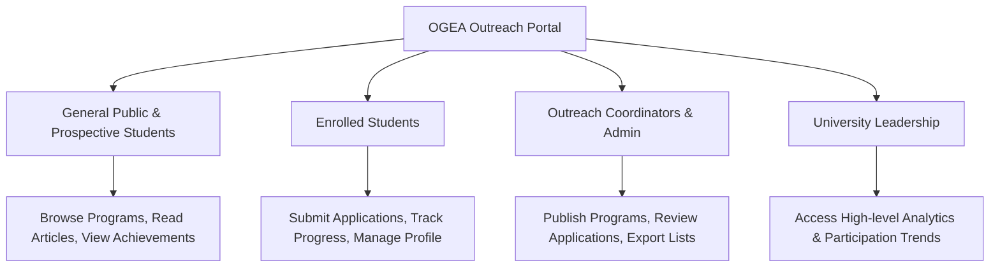

# 🎓 OGEA Outreach Portal — Presentation & Showcase Guide

> **Project Presentation Document**  
> **Platform:** Office of Guidance & External Activities (OGEA) Outreach Management System  
> **Institution:** Secondary & Senior Secondary Institution, Darul Huda Islamic University (DHIU)

---

## 📋 Executive Summary

The **OGEA Outreach Portal** is a web-based outreach and student development platform designed to streamline community engagement, academic initiatives, and external outreach activities.

### The Problem
- Outreach opportunities were previously communicated through fragmented circulars and messaging groups.
- Students lacked a centralized tracker for their applications and deadlines.
- Program coordinators faced manual administrative overhead in collecting candidate data and reviewing applications.
- Institutional achievements and student literary contributions were scattered without a central showcase.

### The Solution
A unified, role-based platform that combines:
1. **Public Discovery Portal**: Transparent public hub for community programs, publications, and milestone achievements.
2. **Student Portal**: One-click application pipeline with live status tracking.
3. **Admin & Coordinator Console**: Full lifecycle management for publishing programs and vetting candidates.
4. **Interactive Analytics**: Visual insights on student participation, outreach distribution, and program efficacy.

---

## 🎯 Target Audiences & Stakeholders



---

## 🌟 Key Feature Modules

### 1. Public Engagement & Discovery Hub
- **Milestone Showcase**: Highlighting the 150+ outreach milestones achieved by DHIU students.
- **Dynamic Program Discovery**: Filter opportunities by category (Social, Academic, Cultural, Leadership).
- **Literary Works Archive**: Digital repository of articles, student thought leadership, and research outputs.
- **Achievements Gallery**: Verified record of institutional accolades and competitive honors.

### 2. Student Experience
- **Frictionless Onboarding**: Swift student registration mapped to academic batches (`UG 2022-26`, `UG 2023-27`, etc.).
- **Live Status Tracking**: Immediate visual indicators for application stages (`Submitted`, `Under Review`, `Shortlisted`, `Selected`, `Rejected`).
- **Personal Dashboard**: Single interface displaying all active and historical applications.

### 3. Administrator & Coordinator Suite
- **Program Studio**: Create, edit, and schedule outreach initiatives with custom eligibility criteria and deadlines.
- **Candidate Evaluation Queue**: Instant status toggle for applicants with filter and search capabilities.
- **Student Roster**: Directory of registered students with contact details and batch records.

### 4. Visual Analytics
- Interactive charts powered by Recharts showing:
  - Outreach program participation across batches.
  - Category distribution (Community, Academic, Welfare).
  - Year-over-year engagement trends.

---

## ⏱️ 5-Minute Live Demo Script & Walkthrough

Use this sequential flow when presenting the live website to stakeholders, evaluators, or an audience:

```
+-----------------------------------------------------------------------------------+
|  STEP 1: LANDING PAGE & BRAND IDENTITY (1 min)                                    |
|  - Open homepage (http://localhost:5173 or live Vercel URL)                      |
|  - Point out Navy & Gold institutional theme and 150-milestone hero banner        |
|  - Show key stat counters (150+ Milestones, 12+ Batches, 500+ Participants)       |
+-----------------------------------------------------------------------------------+
                                         │
                                         ▼
+-----------------------------------------------------------------------------------+
|  STEP 2: PUBLIC DISCOVERY (1 min)                                                 |
|  - Navigate to "Upcoming Programs" -> View program cards & eligibility            |
|  - Navigate to "Literary Works" -> Show category filtering and article reader     |
|  - Navigate to "Achievements" -> Show awards & student honors                     |
+-----------------------------------------------------------------------------------+
                                         │
                                         ▼
+-----------------------------------------------------------------------------------+
|  STEP 3: STUDENT JOURNEY (1.5 min)                                                |
|  - Click "Login" -> Switch to "Student" tab                                       |
|  - Click "Autofill" (student@ogea.edu / Student@123) and Sign In                  |
|  - Show Student Dashboard: Profile details, Batch badge, Active Applications     |
|  - Apply to an open program and demonstrate instant status reflection             |
+-----------------------------------------------------------------------------------+
                                         │
                                         ▼
+-----------------------------------------------------------------------------------+
|  STEP 4: COORDINATOR / ADMIN WORKFLOW (1 min)                                     |
|  - Log out and switch to "Admin" tab on Login page                                |
|  - Click "Autofill" (admin@ogea.edu / Admin@123) and Sign In                      |
|  - Show Admin Dashboard: Program management, Add new program modal                |
|  - Demonstrate reviewing student applications and updating status to "Selected"   |
+-----------------------------------------------------------------------------------+
                                         │
                                         ▼
+-----------------------------------------------------------------------------------+
|  STEP 5: ANALYTICS & CLOSING (0.5 min)                                            |
|  - Navigate to "Analytics" view -> Show visual charts & program metrics           |
|  - Conclude with project impact and future backend integration readiness          |
+-----------------------------------------------------------------------------------+
```

---

## 🔑 Demo Credentials Cheat Sheet

Keep these credentials ready during presentations:

| Role | Email | Password | What to highlight |
| :--- | :--- | :--- | :--- |
| **Student** | `student@ogea.edu` | `Student@123` | Seamless application submission, live status pills |
| **Admin** | `admin@ogea.edu` | `Admin@123` | Program creation, candidate status review, student roster |

> 💡 **Tip:** Both login tabs have a dedicated **"Autofill"** button for instant one-click login during live presentations.

---

## 💡 Key Technical Selling Points

1. **Modern Responsive Design**:
   - Polished Navy & Gold palette reflecting institutional prestige.
   - Glassmorphism navigation bar with responsive mobile menu.
   - Zero-layout shift and responsive design across mobile, tablet, and desktop.
2. **High-Performance Architecture**:
   - Built on **React 19** and **Vite 7** for sub-second page loads.
   - Code splitting with `React.lazy` and `Suspense` for instant navigation.
3. **Resilient Offline-First Data Strategy**:
   - Zero backend dependency required for demonstrations: state and user sessions persist in `localStorage`.
   - Ready for REST API plug-in via environment variables (`VITE_API_BASE_URL`).
4. **Production Deployment Ready**:
   - Single-command build with pre-configured Vercel SPA routing rules.

---

## ❓ Frequently Asked Questions (Q&A Preparation)

**Q1: How does authentication work if there is no backend running?**  
> **Answer:** The portal features a lightweight client-side auth engine using encrypted browser persistence (`localStorage`). It handles role-based access control (`student` vs `admin`) and route guards seamlessly, while being architected to connect to an external REST API with no UI refactoring.

**Q2: How does the system handle concurrent student applications?**  
> **Answer:** The data store indexes applications by unique program IDs and student user IDs, preventing duplicate applications to the same program while maintaining historical records.

**Q3: Can new categories or batch years be configured?**  
> **Answer:** Yes, batches and categories are centralized in `src/lib/mockData.js` and can be customized or dynamically fetched from a database.

**Q4: Is the platform mobile-friendly?**  
> **Answer:** Yes, all layouts, tables, and dashboards utilize Tailwind CSS responsive grids with collapsible drawers and touch-friendly controls.
